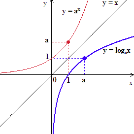

# 빅데이터 분석 플로우 

> 작성일: '22.6/19  
> 빅데이터분석기사 실기 작업2유형 대비를 위해 작성함   

--- 

## 1. 데이터 분석(EDA)
- Exploratory Data Analysis
- 데이터 차원, 형태 파악하기
- 그래프 그려서 예측변수와 다른 변수와의 상관관계 파악하기

## 2. Feature Engineering
- **Tip**: kaggle 등의 정리된 데이터를 풀 때에는 train, test `pd.concat` 해서 결측치 처리 등을 한번에 처리하고 분리해주는게 편리하다.

### 2-1. categorical, numerical features 분리
- using `select_dtypes()`
- numerical 데이터 중에서도 month나 year등의 데이터는 categorical로 분류해주기 `apply(str)`

### 2-2. 비어있는 missing 결측값 채우기
- numerical: mean, median, mode 등을 활용하여 데이터 채우기 `.fillna(), mean(), median(), mode()`

### 2-3. categorical 데이터의 one-hot 인코딩
- catergorical: `pd.get_dummies()` 또는 `LabelEncoder`를 활용하여 missing 데이터 없애고, one-hot encoding 해주기

### 2-4. numerical 데이터 skewness 줄이기
- numerical data의 skewness줄이기
- `from scipy.stats import skew`
- skewness를 줄이기위해 `np.log1p`를 많이 사용하는데 로그함수는 음수에서 `NaN`이 출력됨. 즉 값에 음수가 섞여있다면 `np.log1p` 연산시 `NaN`이 나오게 될 수 있으므로 주의할 것
- 

### 2-5. outlier 값 제거하기
- *train dataset*을 대상으로만 제거할것
```
for col in x_numerical_columns:
    col_IQR = x_train[col].quantile(0.75) - x_train[col].quantile(0.25)
    x_train = x_train.loc[x_train[col].between(x_train[col].quantile(
        q=0.25)-1.5*col_IQR, x_train[col].quantile(q=0.75)+1.5*col_IQR)]

y_train = y_train.loc[x_train.index]
```
- 제거하는 방법 말고, 아웃라이어를 min-max bound 처리해주는 방법도 있는데, 일종의 전처리함수처럼 사용해도됨
    - 전처리함수처럼 사용한다는 의미는 test data도 전처리할때 해주어야한다는 말
    - 물론 안해줬을 때, 성능이 더 잘나온다면, 성능을 기준으로 결정해야할 문제

### 2-6. new features / del features
- 필요하다면

## 3. 모델링
- Dataset: `train_test_split`
- CrossValidation using `cross_val_score, KFold`
- Preprocessing: `StandardScaler, RobustScaler`
- [Regressor](https://scikit-learn.org/stable/search.html?q=Regress): `LinearRegression, RidgeCV, LassoCV, ElasticNetCV...`
- [Classifier](https://scikit-learn.org/stable/search.html?q=classifier): `KNeighborsClassifier, RandomForestClassifier, ...`
- Easy modeling: `make_pipeline`
```
k_fold = KFold(n_splits = 10, shuffle = True, random_state = 0)
kNN = make_pipeline(RobustScaler(),KNeighborsClassifier(n_neighbors=13))
score = cross_val_score(kNN, train_data, y_label, cv= k_fold, n_jobs =1 , scoring='accuracy')
print(np.mean(score))
```

- 참고
```
from sklearn.neighbors import KNeighborsClassifier
from sklearn.tree import DecisionTreeClassifier
from sklearn.ensemble import RandomForestClassifier
from sklearn.naive_bayes import GaussianNB
from sklearn.svm import SVC
from sklearn.pipeline import make_pipeline
from sklearn.preprocessing import StandardScaler, RobustScaler, MinMaxScaler
```

## 4. 분석 및 시각화
- Confusion matrix, ROC curve
- `from sklearn.metrics import confusion_matrix`
- `from sklearn.metrics import classification_report`
- `from sklearn.metrics import roc_auc_score`
```
print(f"randomforest의 confusion mtx: {confusion_matrix(y_val, y_rf_val_pred)}")
print(classification_report(y_val, y_rf_val_pred))
roc_auc = roc_auc_score(y_val, clf_rf.predict_proba(x_val)[:, 1])
print(roc_auc)
```
- graph visualization


## 5. 코드 예시
- 주석을 참고하며, 상기 플로우에 따라 문제를 풀었을 때의 방식을 참고해보자.
- [코드](./data_manim/type2_task_1.py)

- 테스트케이스에서의 성능이 너무 낮으면 roc-auc score가 낮으니, 너무 단순하게 모델 하나 하고 끝내버리면 안되는듯함 (6/21)
- 관련하여 강의를 하나 샘플로 들어보자. 갈라파고스화되면 안되니까

---
